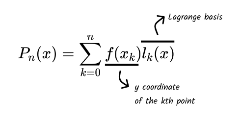
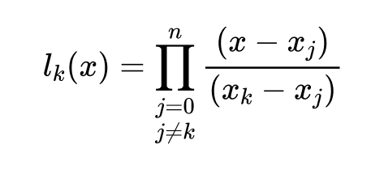

# Interpolation

According to [Wikipedia](https://en.wikipedia.org/wiki/Interpolation):

> In the mathematical field of numerical analysis, interpolation is a type of
> estimation, a method of constructing (finding) new data points based on the
> range of a discrete set of known data points.

In other words, to interpolate is to generate a function from a set of points
such that the function passes through those points.

## Polynomial interpolation

The most common form of interpolation is polynomial interpolation, which is
finding a polynomial of lowest degree possible that interpolates the provided
points.

### Lagrange polynomial

Given a set of `n` points, the
[Lagrange polynomial](https://en.wikipedia.org/wiki/Lagrange_polynomial) of
degree n that interpolates these points is given by:

Where the Lagrange basis formula is:

