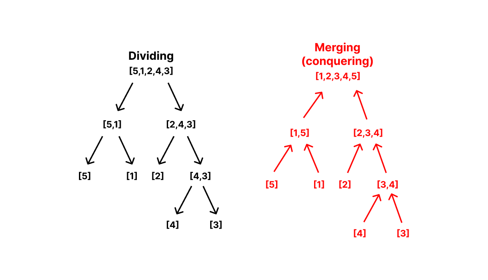

# Merge sort

Merge sort is the prototypical
[divide-and-conquer](https://en.wikipedia.org/wiki/Divide-and-conquer_algorithm)
algorithm. It achieves its goal of sorting an array by dividing the array into
smaller, sorted sub-arrays, to then _merge_ these units into a sorted result.

Consider the array `[5,1,2,4,3]`. Merge sort will divide this array into two
smaller units: `[5,1]` and `[2,4,3]`. Neither of these are still sorted, so each
will be divided yet again, resulting in `[5]`, `[1]`, `[2]` and `[4,3]`. Since
the three first have only one element, then we can consider them to be sorted.
`[4,3]` will still be divided into `[4]` and `[3]`. Now, we have 5 sorted
sub-arrays, ready to be merged into a single one.

The merging process follows the inverse path of the dividing process, meaning
that if we divided `[5,1]` into `[1]` and `[5]`, we will merge them into
`[1,5]`, and so on.

So, `[1]` and `[5]` get merged into `[1,5]`; `[4]` and `[3]` into `[3,4]`, which
then gets merged with `[2]` to give `[2,3,4]`. Finally, `[1,5]` gets merged with
`[2,3,4]` to give `[1,2,3,4,5]`.

