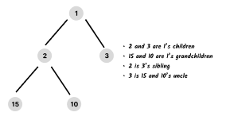

# Trees 🌳

A tree is an abstract data type that is widely used in computer science to
represent a collection of elements with a hierarchical relationship between
them. Each element of the tree is called a **node**, and each node (except the
root) has one parent, but can have many (or even zero) children, depending on
the type of the tree.

It's important to keep in mind some concepts when dealing with trees. Luckily,
most of the terminology is rather intuitive.

A tree is comprised of **nodes**. Each node may or may not have **links** to
other nodes. If the link is to nodes below it, then these are its **children**.
If the link is to a node above it, then that node is its **parent**. Nodes have
only one parent. From this hierarchical relationship, we can derive other
intuitive terms. For example, a node can have **siblings** (nodes who have the
same parent), **grandfather**, **uncles**, etc.

## Tree structures

_To see more details about each structure (best, average, worst complexity,
etc.), check their individual pages._

|                    Tree                     | Implemented |
| :-----------------------------------------: | :---------: |
|           [Binary heap](./heap/)            |     ✅      |
|            [d-ary heap](./heap/)            |     ✅      |
| [Binary search tree](./binary-search-tree/) |     ✅      |
