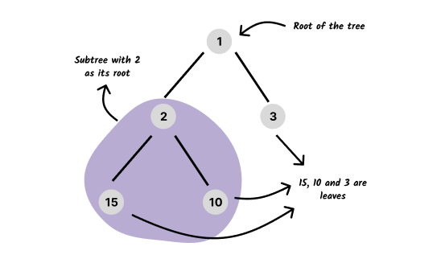

# Trees 🌳

A tree is an abstract data type that is widely used in computer science to
represent a collection of elements with a hierarchical relationship between
them. Each element of the tree is called a **node**, and each node (except the
root) has one parent, but can have many (or even zero) children, depending on
the type of the tree.

It's important to keep in mind some concepts when dealing with trees. Luckily,
most of the terminology is rather intuitive.

A tree is comprised of **nodes**. Each node may or may not have **links** to
other nodes. If the link is to nodes below it, then these are its **children**.
If the link is to a node above it, then that node is its **parent**. Nodes have
only one parent. From this hierarchical relationship, we can derive other
intuitive terms. For example, a node can have **siblings** (nodes who have the
same parent), **grandfather**, **uncles**, etc.

A tree without children is called a **leaf**.

Each tree has a **root**, which is the node at the top of the tree. Also, each
child of a node forms a **subtree**, with that child being the root of the
subtree. A tree is a naturally recursive structure.

A downward sequence of nodes of the tree is called a **path**. The **length** of
said path is the amount of nodes in the sequence minus one. The **height** of
the tree is the length of its longest path. Finally, the **size** of a tree is
given by the number of nodes in it.

It's possible to list many more definitions when it comes to trees, but these
are the most important and are the ones that appear the most.

## Tree structures

_To see more details about each structure (best, average, worst complexity,
etc.), check their individual pages._

|                    Tree                     | Implemented |
| :-----------------------------------------: | :---------: |
|           [Binary heap](./heap/)            |     ✅      |
|            [d-ary heap](./heap/)            |     ✅      |
| [Binary search tree](./binary-search-tree/) |     ✅      |
